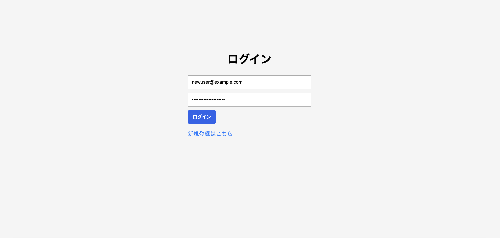
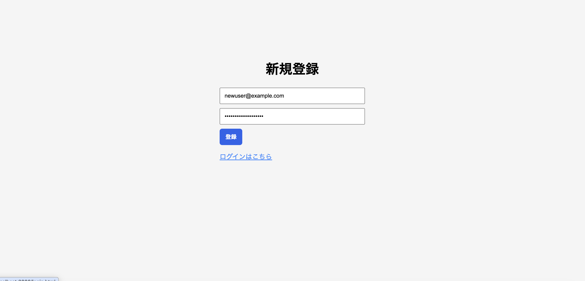
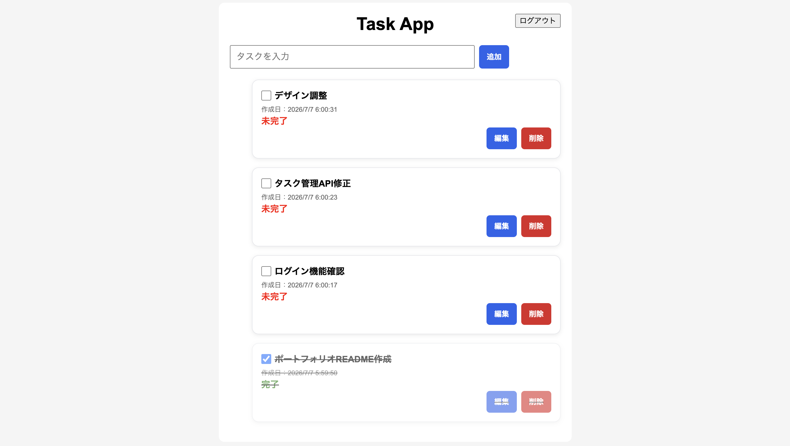
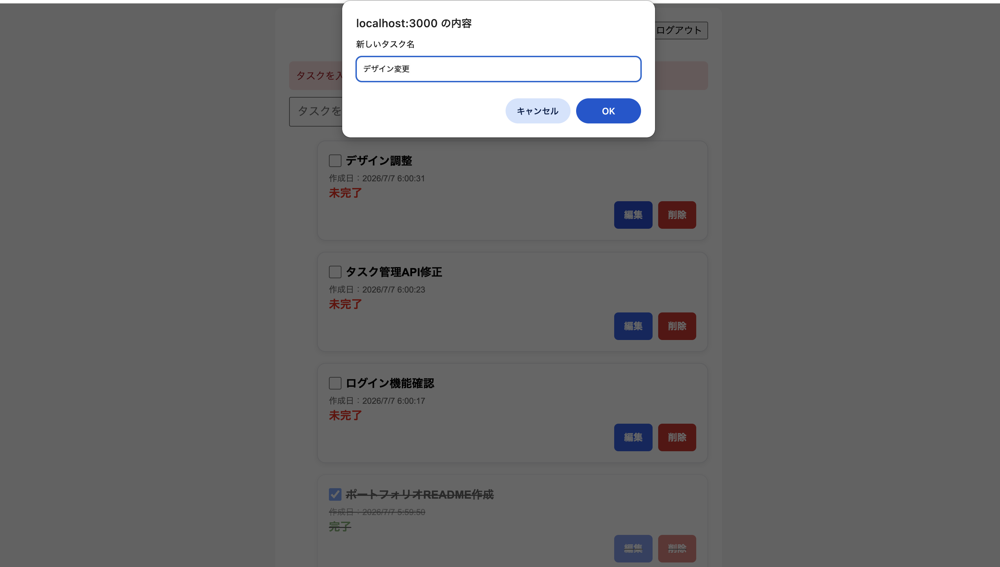

# 📌 JWT Task Manager App


---

## 🎯 Overview（概要）

このプロジェクトは、**JWT認証付きタスク管理アプリ**です。

Node.js・Express・SQLiteを使用し、ユーザー登録・ログイン機能を実装しています。

ログイン後はJWTによる認証を利用し、ユーザーごとに分離されたタスク管理（CRUD操作）ができます。

REST APIを設計し、フロントエンドとバックエンドを分離した構成で開発しています。

また、本番環境（Vercel / Render）へデプロイし、認証・CRUD・API通信・UI表示を含む総合動作確認を実施しています。

---

## 🖥️ Screenshots

### Login



---

### Register



---

### Task List



---

### Edit Task



---

## 🚀 Features（機能）

- ユーザー登録
- ログイン
- ログアウト
- JWT認証
- タスク一覧取得
- タスク追加
- タスク編集
- タスク削除
- タスク完了・未完了切替
- ユーザーごとのタスク管理
- API認証制御
- 入力バリデーション
- エラーハンドリング
- ローディング表示
- 成功メッセージ表示
- レスポンシブ対応

---

## 🌐 Demo（本番環境）

### Frontend

https://task-manager-app-two-omega.vercel.app

### Backend

https://task-manager-app-am1n.onrender.com

---

## 🚀 Deployment

| Service  | Platform |
| -------- | -------- |
| Frontend | Vercel   |
| Backend  | Render   |
| Database | SQLite   |

---
本番環境で以下の動作確認を実施済みです。

- Frontend → Backend API通信
- JWT認証
- CRUD操作
- ユーザーごとのデータ分離
- ページリロード確認
- APIエンドポイント確認

---

## 🧪 Testing（動作確認）

本番環境にて総合テストを実施しました。

### テスト概要

| 項目       | 内容                  |
| ---------- | --------------------- |
| 実施環境   | Vercel / Render       |
| ブラウザ   | Chrome / Safari       |
| テスト項目 | 58項目                |
| 結果       | 56項目 OK             |
| 未対応     | 2項目（今後対応予定） |

### 確認内容

- CRUD機能
- JWT認証
- token有効・無効確認
- ユーザー分離
- 入力バリデーション
- エラー表示
- ローディング表示
- スマホ表示
- API通信
- デプロイ環境確認

詳細：

- [Test Specification](./docs/test-specification.md)
- [Test Result](./docs/test-result.md)

---

## 🛠 Tech Stack（使用技術）

### Frontend

- HTML
- CSS
- JavaScript (Vanilla JS)
- Fetch API

### Backend

- Node.js
- Express

### Database

- SQLite3

### Authentication

- JWT (jsonwebtoken)
- bcrypt
- dotenv

---

## 📁 Project Structure

```text
task-manager-app/
│
├── public/
│   ├── index.html
│   ├── login.html
│   ├── register.html
│   ├── style.css
│   └── js/
│       ├── api.js
│       ├── app.js
│       ├── login.js
│       ├── register.js
│       └── ui.js
│
├── routes/
│   ├── auth.js
│   └── tasks.js
│
├── middleware/
│   └── authMiddleware.js
│
├── docs/
│   ├── API.md
│   ├── test-specification.md
│   └── test-result.md
│
├── screenshots/
│   ├── login.png
│   ├── register.png
│   ├── task-list.png
│   └── task-edit.png
│
├── db.js
├── index.js
├── package.json
├── package-lock.json
├── README.md
└── tasks.db
```

---

## ⚙️ Getting Started（セットアップ方法）

### 1. リポジトリをクローン

```bash
git clone https://github.com/jkt-gh/task-manager-app.git
```

### 2. ディレクトリへ移動

```bash
cd task-manager-app
```

### 3. パッケージをインストール

```bash
npm install
```

### 4. .envを作成

```env
PORT=3000
DB_PATH=./tasks.db
JWT_SECRET=your_secret_key
```

### 5. サーバー起動

```bash
npm start
```

または

```bash
npx nodemon index.js
```

---

## 🌐 Access

ブラウザでアクセス：

```
http://localhost:3000
```

初回アクセス：

```
http://localhost:3000/register.html
```

からユーザー登録してください。

---

## 🔗 Links

GitHub Repository

```bash
https://github.com/jkt-gh/task-manager-app
```

Local Demo

```bash
http://localhost:3000
```

---

## 📘 API Documentation

REST APIの詳細仕様をまとめています。

内容：

- Endpoint一覧
- Request Body
- Response形式
- JWT Authentication
- Error Response
- Database Structure

詳細：

[API Specification](./docs/API.md)

---

## 📡 API Specification（概要）

### Authentication

| Method | Endpoint           | Description  |
| ------ | ------------------ | ------------ |
| POST   | /api/auth/register | ユーザー登録 |
| POST   | /api/auth/login    | ログイン     |

---

### Tasks

| Method | Endpoint       | Description    |
| ------ | -------------- | -------------- |
| GET    | /api/tasks     | タスク一覧取得 |
| POST   | /api/tasks     | タスク追加     |
| PUT    | /api/tasks/:id | タスク更新     |
| DELETE | /api/tasks/:id | タスク削除     |

---

## 🔐 Authentication

ログイン成功後、JWTトークンを発行します。

取得したトークンは

```
localStorage
```

へ保存します。

APIアクセス時には以下の形式で送信します。

```
Authorization: Bearer <token>
```

JWTが無効または期限切れの場合は認証エラーとして処理されます。

---

## 💡 Key Highlights（工夫した点）

- JWTによる認証機能
- bcryptによるパスワードハッシュ化
- Express Routerによるルーティング分割
- Middlewareによる認証処理
- REST API設計
- Fetch APIによる非同期通信
- フロントエンド・バックエンド分離
- SQLiteによるデータ管理
- ユーザー単位のデータ分離
- 本番環境でのテスト設計・実施

---

## 📚 Learning Purpose（学習目的）

- Node.jsによるWebアプリ開発
- Express Routerの利用
- JWT認証
- bcryptによるパスワード管理
- SQLite操作
- REST API設計
- CRUDアプリケーション開発
- フロントエンドとバックエンドの連携
- テスト仕様書・結果管理

---

## 📈 Future Improvements（今後の改善）

- タスク検索
- ソート機能
- ページネーション
- Reactへの移行
- PostgreSQLへの移行
- completed入力値のAPIバリデーション強化

---

## ⚠️ Notes（注意事項）

- node_modulesはGitHubへ含めていません
- .envはGitHubへ含めていません
- tasks.dbは初回起動時に自動生成されます
- 動作確認テストNo.42、No.43のcompleted入力異常系テストは今後対応予定です

---

## 👤 Author

Node.js・Express・SQLite・JWTを使用して開発した認証付きタスク管理アプリです。

Express Router・Middleware・JWT認証・CRUD操作を組み合わせ、実務を意識した構成で開発しました。

本番環境へのデプロイ、API通信確認、テスト仕様作成まで実施し、開発からリリース確認までの一連の流れを経験できる構成にしています。
